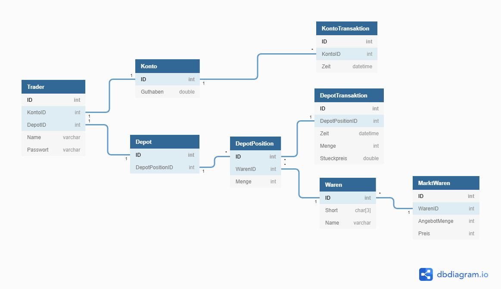

# Börsenplanspiel
Ein virtueller Markt auf dem mit Waren gehandelt werden kann.

## Anforderungen
* Server-Client-Struktur
  * Server repräsentiert die Börse
  * Clients sind Händler an der Börse
* Server sollte so entwickelt werden, dass die Quelle der Aktienkurse leicht austauschbar ist (Interfaces)
* User können sich mit Username u. Passwort einloggen
  * State ist persistent auf Server
* Viele Clients gleichzeitig (Multiplayer)

## Fragen
### Konzeptionelles
* ✅ Echtzeit
* Welche Prozesse müssen definiert werden?
  * Kaufen
  * Verkaufen
  * Neue Waren auf den Markt bringt
* Woher die Daten nehmen?
  * Welche kommt als Anforderung ins Lastenheft?
    * Unten diskutierte Möglichkeiten laufen hinaus auf zwei Optionen:
        * ✅ Eigene, kleine Marktsimulation, wie in manchen PC-Spielen
  * Mögliche Datenquellen
    * __Random Werte__
      * ✅ easy
      * ✅ komplett eigenes System
      * ❌ mäßig interessant
    * __Eigenes, steuerbares Modell__
      * ✅ cool
      * ❌ sehr anspruchsvoll
    * __reale Daten aus dem Netz__
      * ✅ cool
      * ✅ realistisch
      * ❌ Einfluss des Spielers nur schwer zu realisieren
      * passt nicht zu Anforderung
        * Wenn dann macht nur _Option 2_ (siehe unten) Sinn
      * _Variante A:_ Live-Daten
      * _Variante B:_ historische Daten
      * Einfluss der Spieler auf den Markt
        * Wie wird die Abweichung zu den Realdaten behandelt?
          * _Option 1:_ Nur der Startpunkt sind Echtdaten, danach eins der anderen Modelle
            * ❌ witzlos, weil wen interessiert es, wie die Ausgangssituation hergestellt wird?
          * _Option 2:_ Spielerhandeln schlägt sich nicht im Markt nieder
            * ✅ klassisches Börsenplanspiel, cool weil realistisch
            * ❌ Nur ein Wetten auf Kurse. Kein Taktieren, kein anderen Spielern zuvorkommen, keine illegalen Absprachen usw. möglich
            * ❌ Gibt es genau so schon, z.B. [FAZ Börsenspiel](https://boersenspiel.faz.net/boersenspiel/index.htn?gId=206)
          * _Option 3:_ Echte Kurse beeinflussen unseren virtuellen Markt, gleichzeitig kann der Spieler Einfluss nehmen
            * ❌ viel zu kompliziert, können wir nicht leisten
      * Mögliche Quellen:
        * [Alpha Vantage](https://www.alphavantage.co)
### Technisches
* Plattform Server
  * ASP.NET Core 2.2
  * UI: Weboberfläche
* Client
  * ASP.NET Core 2.2
  * UI: Weboberfläche
* Kommunikation zwischen Server u. Client
  * RESTful API
* User Accounts
  * einfach Tabelle mit Username+Passwort+Konto+Depot
### Management und Wirtschaft 
* Lizenz
  * [MIT](https://de.wikipedia.org/wiki/MIT-Lizenz)

## Datenmodell
Entwurf eines Datenmodells des Marktes

## Brainstorming
* Bots (automatisierte Clients)
  * Automatisierter Händler der nach einem Algorithmus Gewinn macht
  * Bot-Schwärme, die durch Aufkäufe einen Preis hochtreiben und dann auf einen Schlagt verkaufen => Crash!
* Visualisierungen
  * Liniendiagramm von Kursentwicklung
  * Zuwachs und Verluste
    * Als Tabelle in grün und rot
    * Liniendiagramm vom Verlauf
* Handel zwischen Spielern
* Datieren von zukünftigen automatischen Verkäufen
* Scripting (geht ja eigentlich eh über die API aber entsprechend dokumentieren)